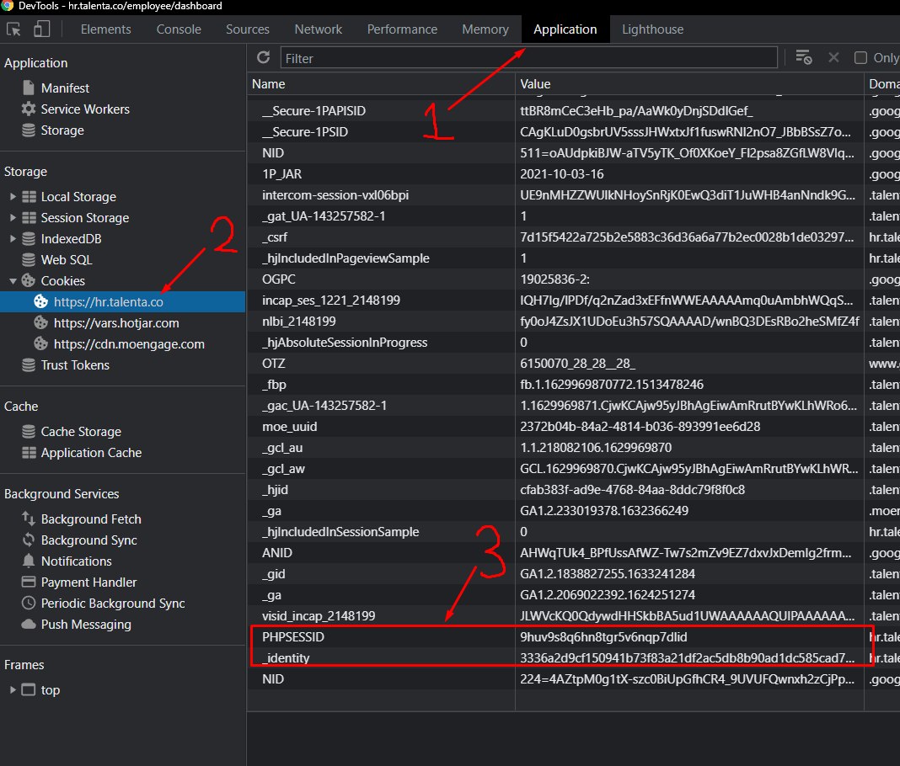
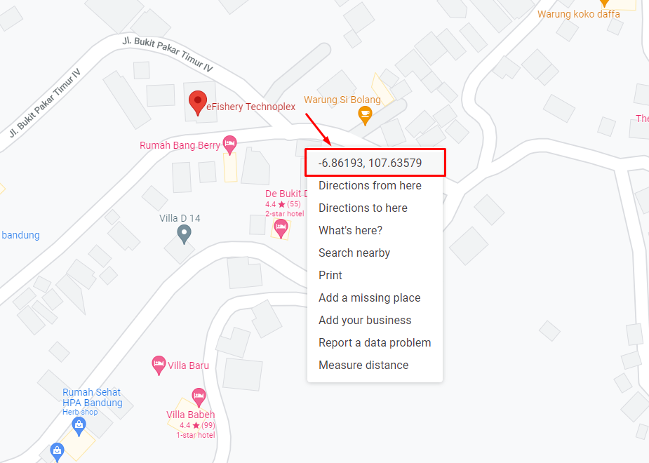

<h1 align="center">Talenta-api</h1>

API HR Talenta for ClockIn and ClockOut, so you don't need to open the app and clockin/clockout

## Requirement
1. npm
2. nodejs
3. yarn

## Installation
Just run `yarn install` or `npm install`

## How to Run Program

At first you need to specify this three variable `Cookie`, `Latitude` and `Longitude`.  
You could copy from `config.js.tmpl` to `config.js` then change it according your value.  
Then you could run using script defined in `package.json`

### How to get Cookie?

1. you need to login with this url `https://account.mekari.com/users/sign_in?app_referer=Talenta` and sign in

2. after login on the browser press `F12`
3. the new window/new window on bottom screen will popup and switch to `Application` tab, pick `Cookie`->`https://hr.talenta.co` and then scroll down until get the Cookie with name `PHPSESSID` or `_identity` 

4. copy the value
5. prepare the value for program with `PHPSESSID=<value>` or `_identity=<value>`
6. open the file `config.js` (copy from `config.js.tmpl`) and change the variable `cookiesTalenta` to `PHPSESSID=<value>` or `_identity=<value>`
6. and good news the cookie will last forever

### How to get Latitude and Longitude?

1. its easy, just go to google map
2. right click on the location

3. and select the first menu, your latitude and longitude will be copied and separated with "`,`" like this
```
-6.861928521923624, 107.63578698474662
Latitude          , Longitude
```
4. open the file `config.js` (copy from `config.js.tmpl`) and change the variable `latitude` and `longitude` following with the value copied from google map

### Example to run the program

after everything complete you just need to run this to clockin
```
yarn run clockin
``` 
or 
```
yarn run clockout
```
to clockout

### How to schedule your clockIn and clockOut
It is just by adding `timeClockIn` and `timeClockOut` within `config.js` file. The time format is `hh:mm`.
It is important to note, that you have to define both variables, otherwise, the scheduler won't work.

To start the scheduler, simply run
```
yarn scheduler:start
```

And to stop the scheduler, run,
```
yarn scheduler:stop
```

If you want to change the time for your clockIn and clockOut, you have to stop and restart the scheduler.

## Methods in module

### Clock In / ClockOut
Functions: `clockIn` and `clockOut`  
Parameters
```
{ lat: '-6.000', long: '107.000', cookies: 'PHPSESSID=<value>', desc: 'message' }
```