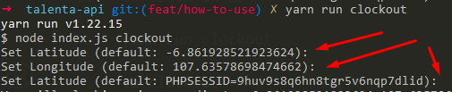

# Talenta-api
API HR Talenta for ClockIn and ClockOut, so you don't need to open the app and clockin/clockout

# Requirement
1. npm
2. nodejs
3. yarn

# Installation
Just run `yarn install`

# How to Run Program

At first you need to specify this three variable `Cookie`, `Latitude` and `Longitude`

## How to get Cookie?

1. you need to login with this url `https://account.mekari.com/users/sign_in?app_referer=Talenta` and sign in

2. after login on the browser preff `F12`
3. the new window/new window on bottom screen will popup and switch to `Application` tab, pick `Cookie`->`https://hr.talenta.co` and then scroll down until get the Cookie with name `PHPSESSID` or `_identity` 

4. copy the value
5. prepare the value for program with `PHPSESSID=<value>` or `_identity=<value>`
6. and good news the cookie will last forever

## How to get Latitude and Longitude?

1. its easy, just go to google map
2. right click on the location

3. and select the first menu, your latitude and longitude will be copied and separated with "`,`"

```
-6.861928521923624, 107.63578698474662
Latitude          , Longitude
```

## Run the Program

after everything complete you just need to run this to clockin
```
yarn run clockin
``` 
or 
```
yarn run clockout
```
to clockout

after running that command line, the program will prompt the cookie and coordinate value, just enter if you want to use the default



to remove the input prompt, change the default variable of cookie and coordinate and remove this code
```
const inputPrompt = dataInput();
```
